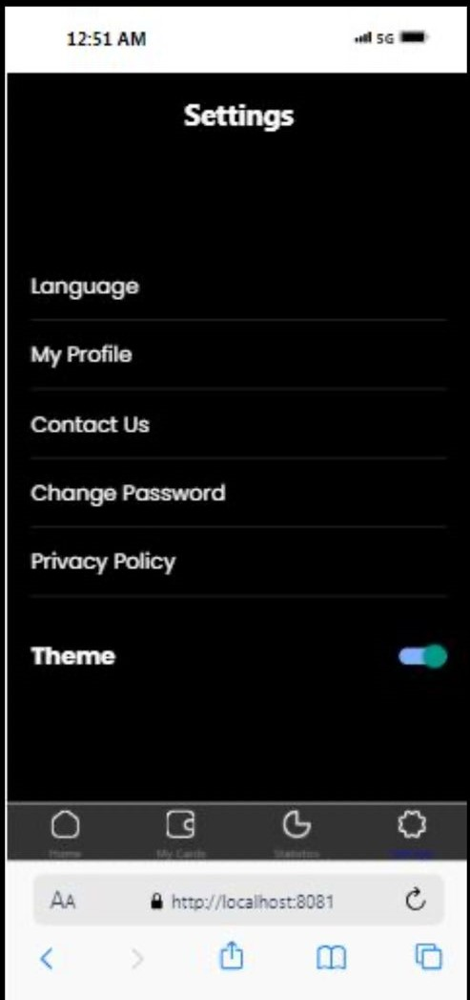
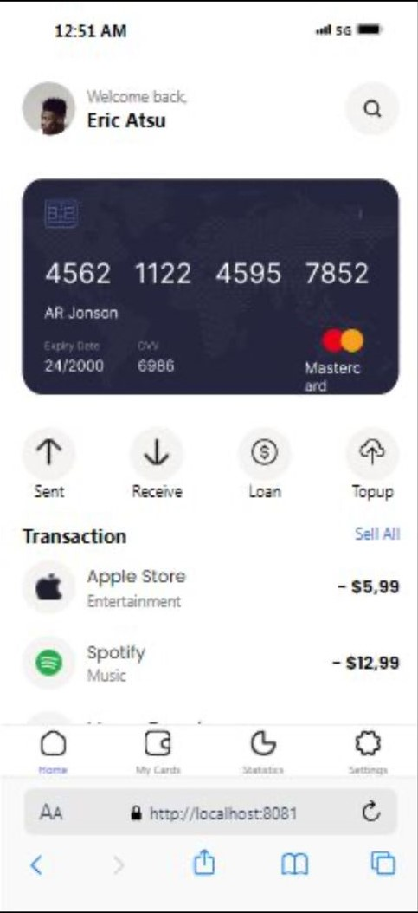
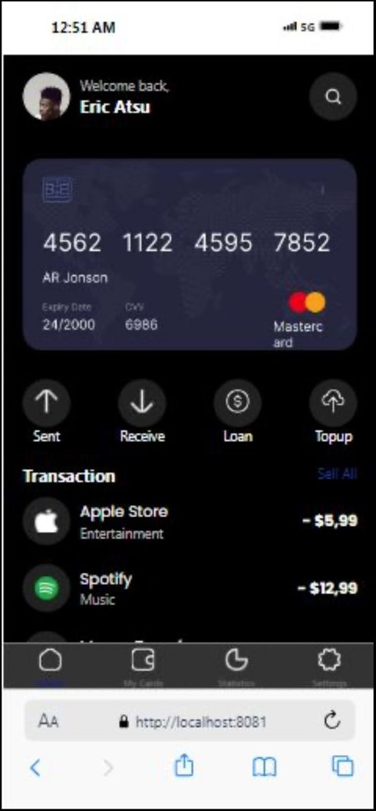
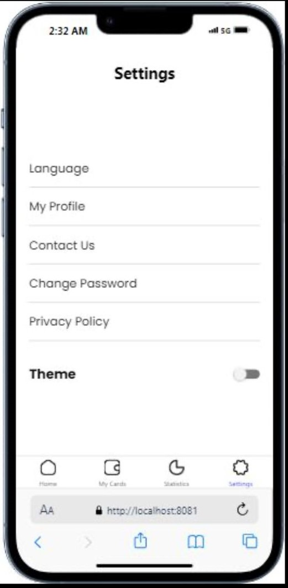

### How the App Was Built
1. Setting Up the Project
The project was initialized using React Native CLI. React Navigation was used to manage the navigation between different screens.

2. Navigation
AppNavigator.js: Contains the NavigationContainer and the bottom tab navigator. Each tab is associated with a screen (Home and Settings).
Icons: Used Ionicons for tab icons to visually represent each tab.
3. Home Screen
Header: Displays a welcome message and a profile image.
Card: Shows credit card information with styling for details like card number, expiry date, and CVV.
Actions: Contains buttons for actions like send, receive, loan, and top-up, each with an icon.
Transactions: Displays a list of transactions using a FlatList, with each item showing a transaction's title, category, and amount.
Footer: Contains icons for navigation. Each icon is wrapped with TouchableOpacity to handle navigation between Home and Settings screens.
4. Settings Screen
Toggle Option: Allows users to toggle settings such as the theme. More settings can be added as required.

### Screenshots

